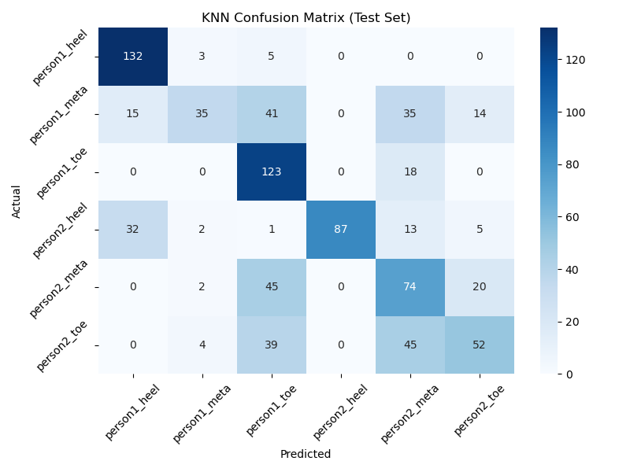
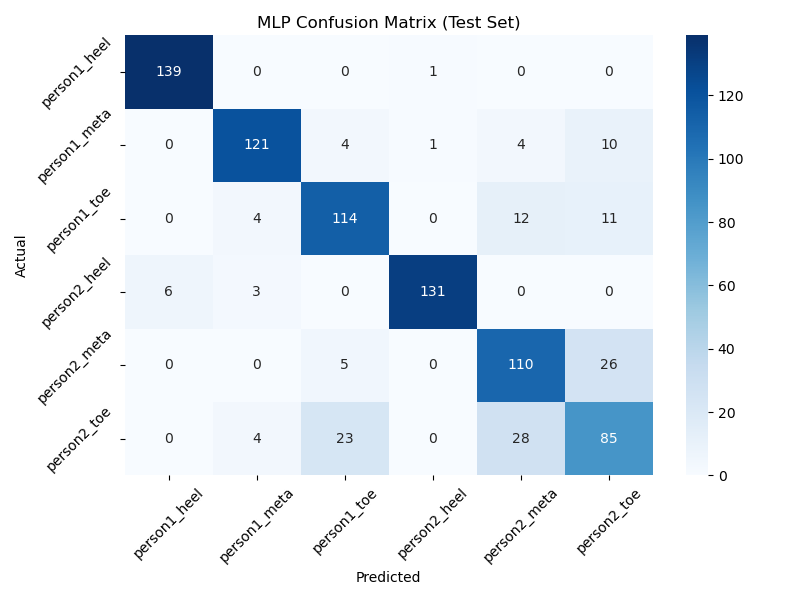
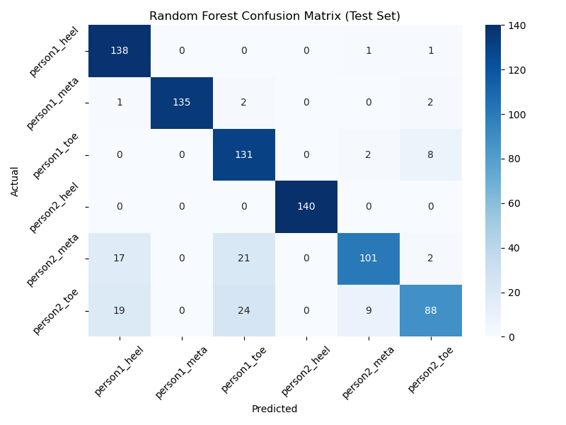
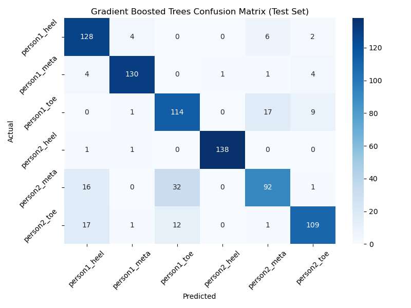
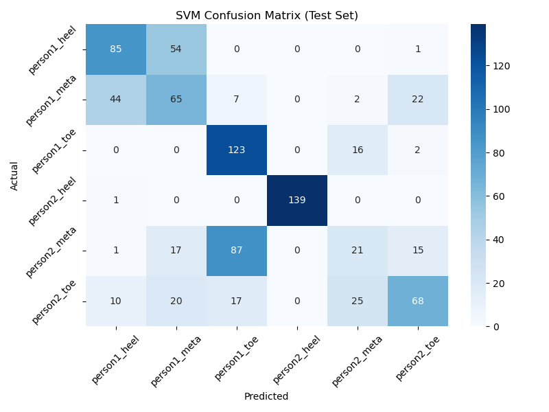
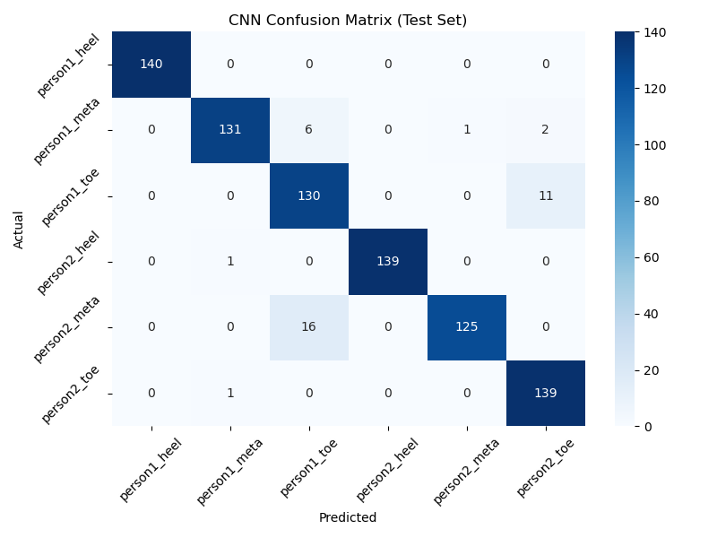

# ai-teng-nano-sensor

This repository holds the code to train different ML and NN algorithms on Rehabilitation Monitoring Data to classify Persons and Sensor locations. We experimented with Random Forests, K-Nearest-Neighbour,  Multi-Layer-Perceptron, Support-Vector-Machine, Gradient-Boosted-Trees and Convolutional Neural Network.

The data we used was captured by different TENG nano sensors attached to persons doing various tasks and activities. 

## Installation
Use a virtual environment (optional but recommended), then run

```
pip install -r requirements.txt
```

## Usage

In main.py, change the path of the base directory to your datapath.
In the preprocessing.py, one can change the stride and the window_size.

Run the project by executing the main.py:

```
python main.py
```

## Results

### Confusion Matrices








